# 💰 Personal Expense Tracker

Managing personal finances can be challenging. To simplify this, I built the **Personal Expense Tracker** using Django. It helps users easily **add, track, filter, and manage income and expenses** all in one place. Users can also update their profile, change passwords, and maintain full control over their financial data.

---

## 🌐 Live Demo

🔗 [View Live Application](https://expensetracker-frontend-08uj.onrender.com/)  
🔗 [View Live Application Backend ](https://expense-tracker-backend-u02t.onrender.com/)
))  

---

## 📸 Screenshots

### 🏠 Home  
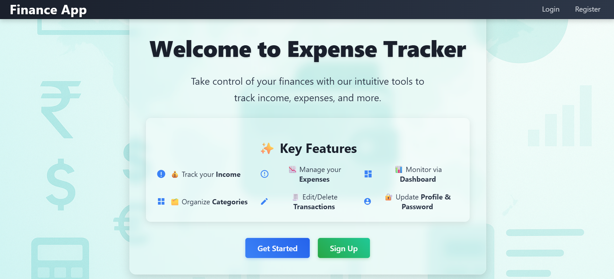

### 🔐 Login 
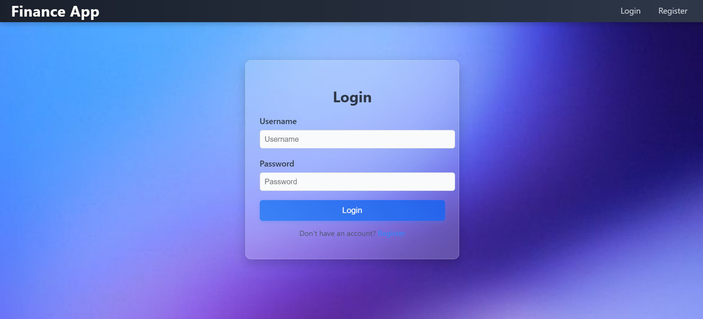

### 📝 Signup
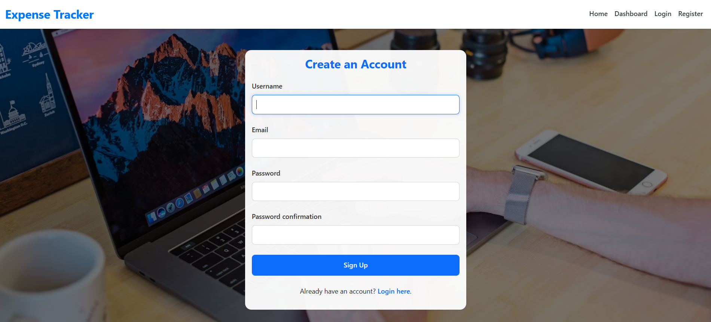

### 🏠 Dashboard  
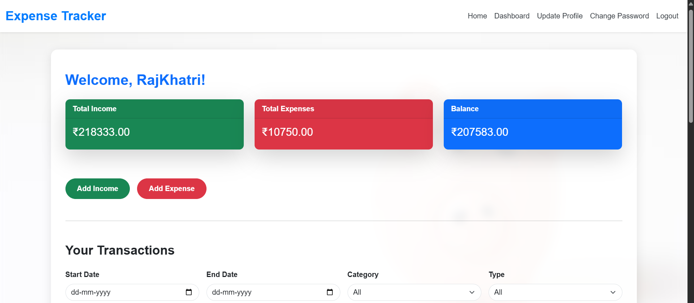

### ➕ Add Income  
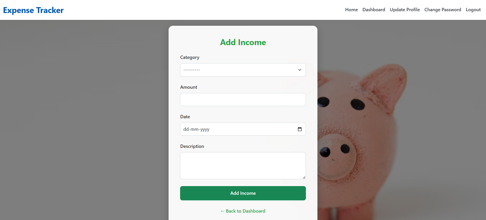

### ➕ Add Expense  
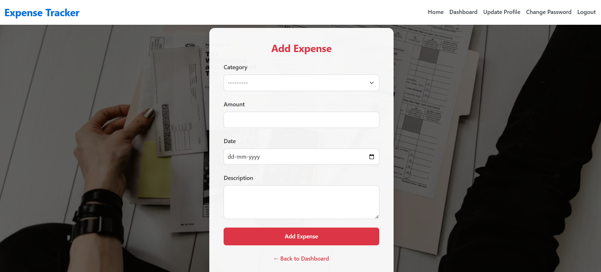

### ✏️ Edit Transaction  
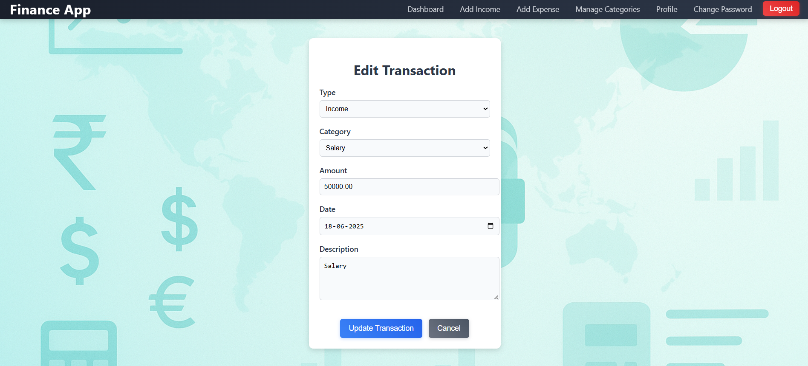

### 🗑️ Delete Transaction  
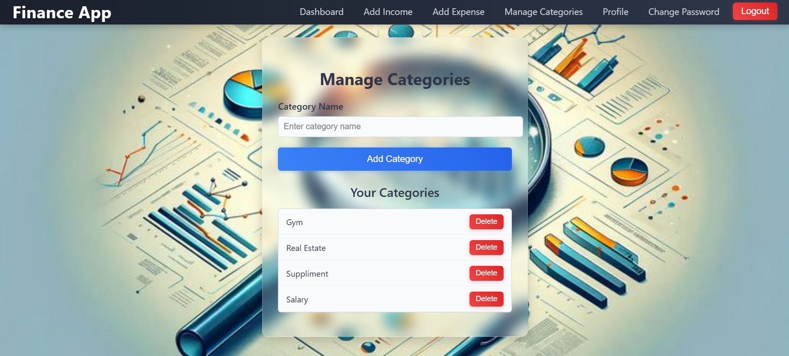

### 📅 Filter Transactions  
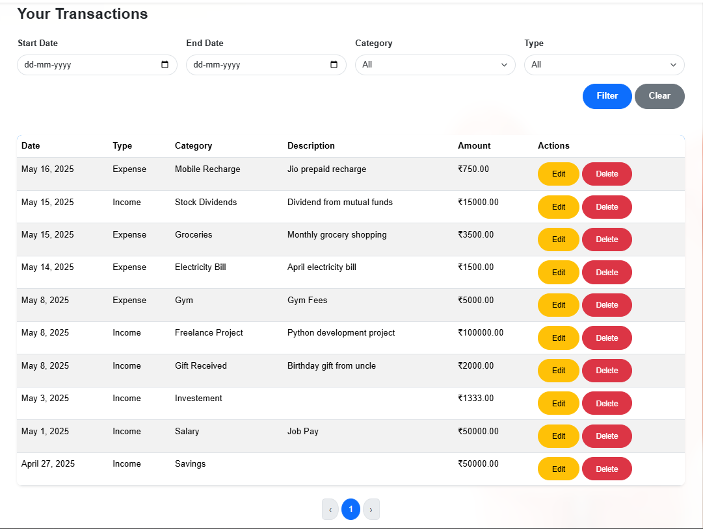

### 👤 Update Profile  
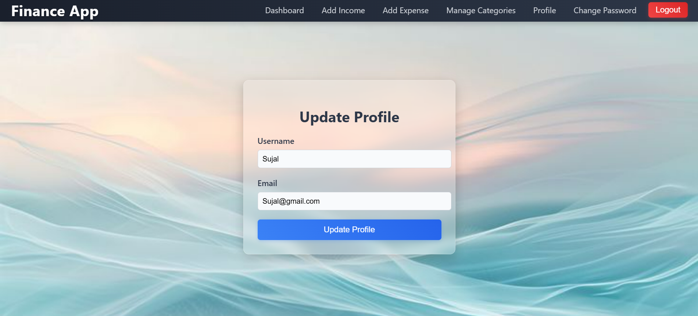

### 🔐 Change Password  
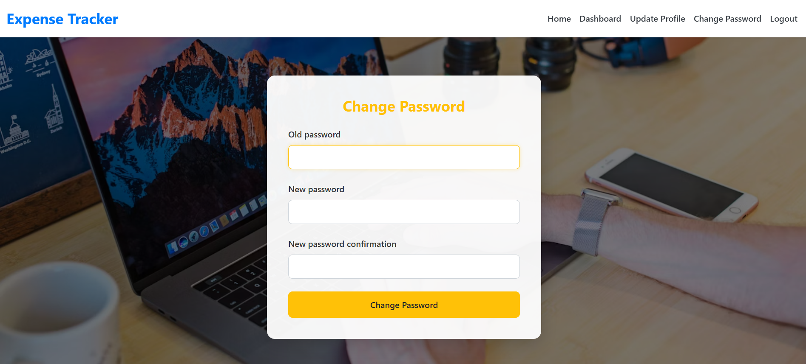

### 🗂️ Category  
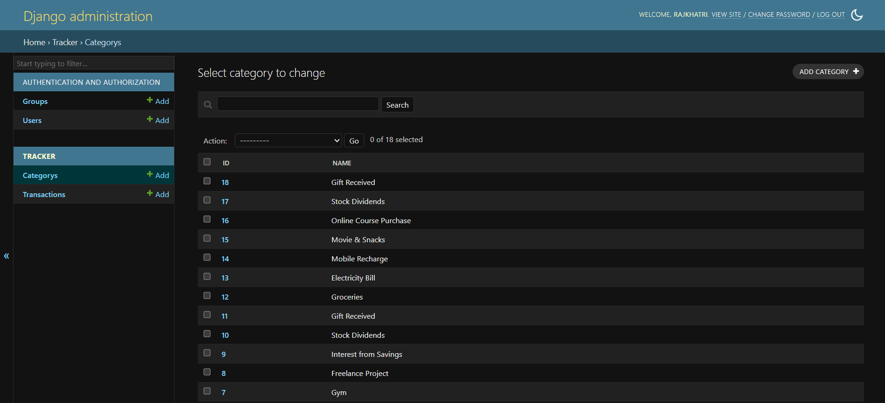

### 📁 Transaction History
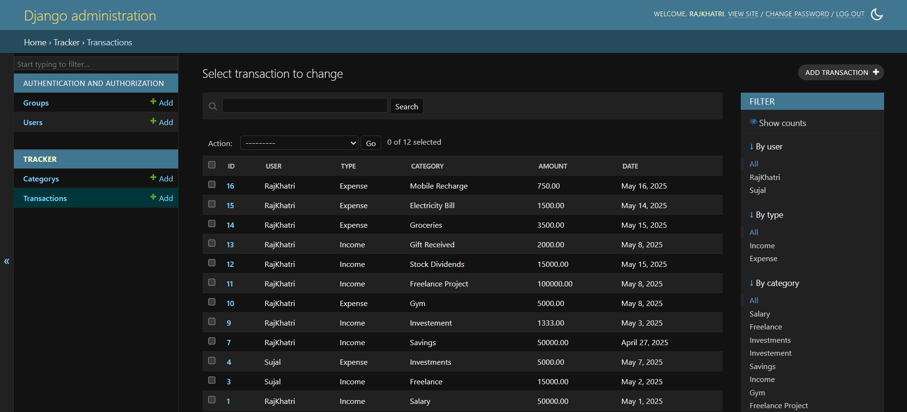
---

## 🔍 Features

- ➕ **Add Income & Expense Transactions**
- 🔄 **Edit or Delete Existing Transactions**
- 🔎 **Filter by Date, Income, or Expense**
- 📅 **View All Transactions with Date, Category, and Description**
- 👤 **Update User Profile**
- 🔐 **Secure Password Change**
- 🧾 *(Upcoming)* CSV Export & Chart Visualization

---

## 🛠️ Tech Stack

- **Frontend:** HTML5, CSS3, Bootstrap
- **Backend:** Python, Django
- **Database:** MySQL
- **Others:** Django Templates, Django Auth, Static Files

---

## 📁 Project Structure

Expense-Tracker/
├── tracker/  
│ ├── migrations/  
│ ├── templates  
│ ├── static/  
│ ├── admin.py  
│ ├── models.py  
│ ├── views.py  
│ ├── urls.py  
│ └── forms.py  
├── ExpenseTracker/  
│ ├── settings.py  
│ ├── urls.py  
│ └── wsgi.py  
├── manage.py  
├── db.sqlite3  
└── requirements.txt

---

## 🚀 Getting Started

### 🔧 Prerequisites

- Python 3.7+
- pip (Python package installer)

### 💻 Installation Steps

```bash
# 1. Clone the repository
git clone https://github.com/khatri-raj/Expense-Tracker.git
cd Expense-Tracker

# 2. Create and activate virtual environment
python -m venv venv
source venv/bin/activate      # On Windows: venv\Scripts\activate

# 3. Install dependencies
pip install -r requirements.txt

# 4. Apply migrations
python manage.py makemigrations
python manage.py migrate

# 5. Run the development server
python manage.py runserver
Then go to: http://127.0.0.1:8000

🔐 Admin Access:
python manage.py createsuperuser
Login at: http://127.0.0.1:8000/admin

📦 Sample requirements.txt
Django>=4.0,<5.0
pytz
sqlparse
asgiref
🤝 Contributing
Pull requests are welcome. For major changes, please open an issue first to discuss what you'd like to change or improve.

📫 Contact
Name: Raj Khatri
Email: rajkhatri8060@gmail.com
GitHub: @khatri-raj
