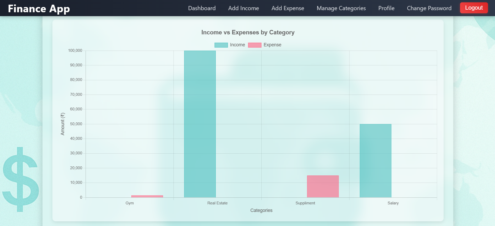
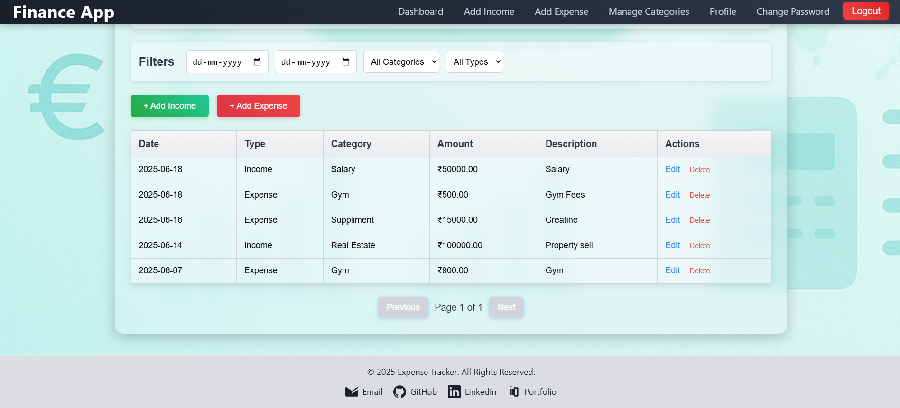
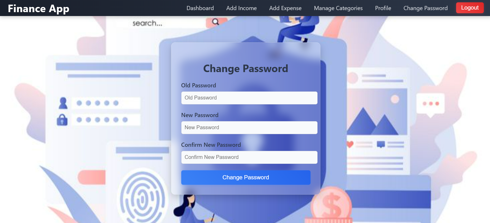

# 💰 Personal Expense Tracker

Managing personal finances can be challenging. To simplify this, I built the **Personal Expense Tracker** using Django. It helps users easily **add, track, filter, and manage income and expenses** all in one place. Users can also update their profile, change passwords, and maintain full control over their financial data.

---

## 🌐 Live Demo

🔗 [View Live Application](https://expensetracker-frontend-08uj.onrender.com/)  
🔗 [View Live Application Backend ](https://expense-tracker-backend-u02t.onrender.com/)

---

## 📸 Screenshots

### 🏠 Home  


### 🔐 Login 


### 📝 Signup


### 🏠 Dashboard  



### ➕ Add Income  


### ➕ Add Expense  


### ✏️ Edit Transaction  


### 🗂️ Manage Categories


### 📅 Filter Transactions  


### 👤 Update Profile  


### 🔐 Change Password  


### 🗂️ Category  


### 📁 Transaction History

---

## 🔍 Features

- ➕ **Add Income & Expense Transactions**
- 🔄 **Edit or Delete Existing Transactions**
- 🔎 **Filter by Date, Income, or Expense**
- 📅 **View All Transactions with Date, Category, and Description**
- 👤 **Update User Profile**
- 🔐 **Secure Password Change**
- 🧾 *(Upcoming)* CSV Export & Chart Visualization

---

## 🛠️ Tech Stack

- **Frontend:** React.js, HTML5, CSS3, Bootstrap
- **Backend:** Python, Django, Django REST Framework
- **Database:** PostgreSQL
- **Others:** JWT Authentication, Axios, Django Templates (for admin only), Framer Motion (optional for UI)

---

## 📁 Project Structure

Expense-Tracker/
├── backend/
│   ├── tracker/
│   │   ├── migrations/
│   │   ├── models.py
│   │   ├── views.py
│   │   ├── urls.py
│   │   ├── forms.py
│   │   └── ...
│   ├── ExpenseTracker/
│   │   ├── settings.py
│   │   ├── urls.py
│   │   └── wsgi.py
│   ├── manage.py
│   ├── requirements.txt
│   └── ...
├── expense-tracker-frontend/
│   ├── public/
│   ├── src/
│   │   ├── components/
│   │   ├── pages/
│   │   ├── App.js
│   │   └── ...
│   ├── package.json
│   └── ...


---

## 🚀 Getting Started

### 🔧 Prerequisites
- Python 3.7+
- Node.js and npm
- PostgreSQL

---

### 💻 Backend Setup (Django + PostgreSQL)
```bash
git clone https://github.com/khatri-raj/Expense-Tracker.git
cd Expense-Tracker/backend

# Create virtual environment
python -m venv venv
source venv/bin/activate      # On Windows: venv\Scripts\activate

# Install dependencies
pip install -r requirements.txt

# Setup .env and configure DB
# Run migrations
python manage.py migrate

# Create superuser and start server
python manage.py createsuperuser
python manage.py runserver

💻 Frontend Setup (React)
cd ../frontend
npm install
npm start
Frontend will st

📦 Sample requirements.txt
Django>=4.0,<5.0
pytz
sqlparse
asgiref
🤝 Contributing
Pull requests are welcome. For major changes, please open an issue first to discuss what you'd like to change or improve.

📫 Contact
Name: Raj Khatri
Email: rajkhatri8060@gmail.com
GitHub: @khatri-raj
